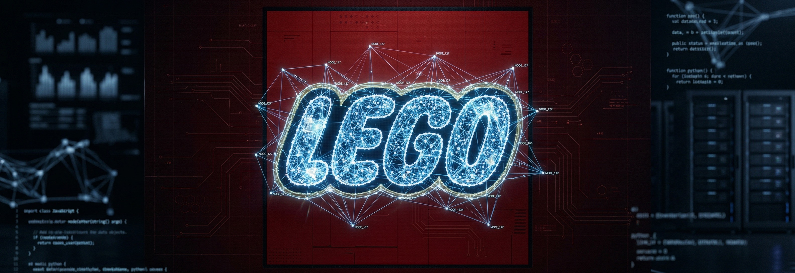
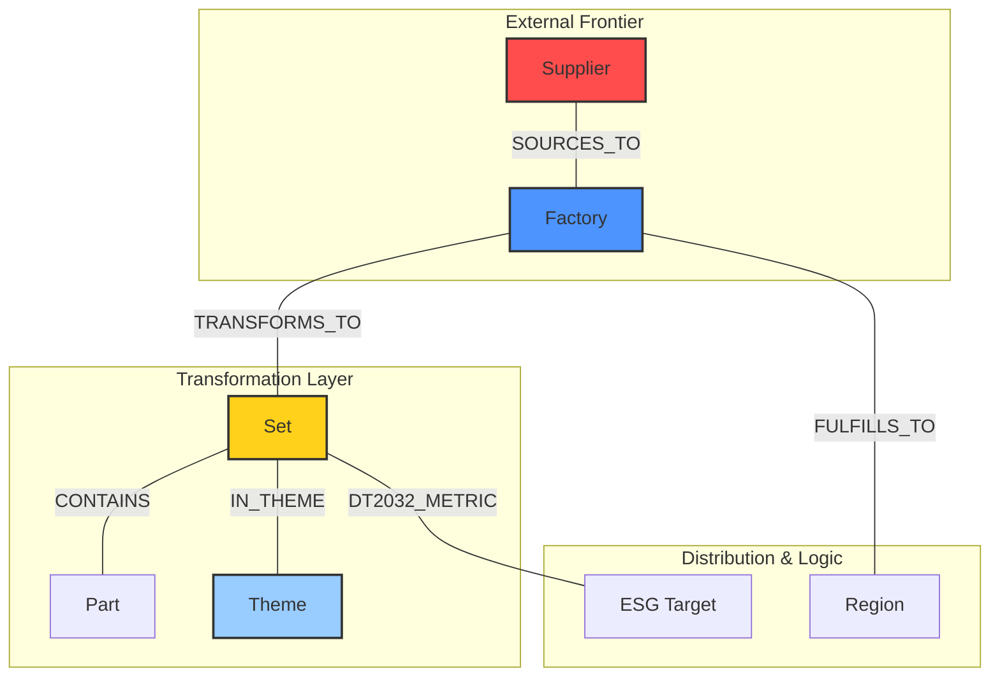
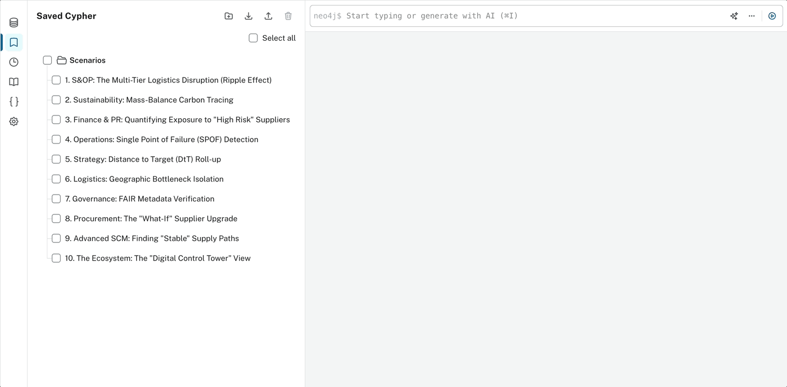
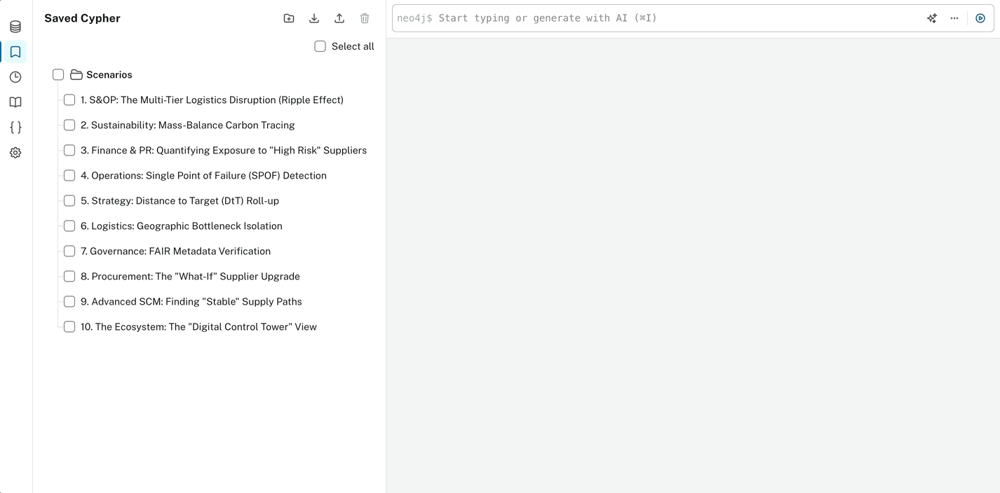

<div align="center">
  
<br>
  
---
  
# LEGO Supply-Chain & Sustainability Knowledge Graph

<br>

  [](https://www.linkedin.com/in/YOUR-PROFILE-URL)
  [-00b43f)](brain/planning/CHANGELOG.md)
  [](brain/planning/STRATEGY.md)
  [](brain/context/SCOR_DS_v14_0_ONTOLOGY.md)
  [%20|%20SCOR%20DS%20v14.0%20|%20Mass%20Balance-fda8d1)](brain/context/PROTOCOL.md)
  [](https://neo4j.com/)
  []()
  [](.github/workflows/sync-showcase.yml)
  [](.github/workflows/ci.yml)

></div>
---

## 🧭 Let's Get Started (TL;DR)

When enterprise data lives in silos—spreadsheets, ERPs, disconnected SAP instances—upstream disruptions leave planners flying blind. The LEGO Group needs an active semantic layer: an **[EKP (Enterprise Knowledge Platform)](#local-glossary)**.

This repository is a **Strategic Prototype** of that platform. Using a Neo4j Knowledge Graph and **[FAIR(EST)](#local-glossary)** principles, it transforms 27,000+ fragmented relationships into actionable Decision Intelligence.

I'm **Alexander Hegelund**, and I built this to demonstrate my product strategy, supply chain domain expertise, and technical depth for the Senior PM – EKP role.

<details>
<summary><b>🗺️ Expand Table of Contents</b></summary>

- [🧭 Let's Get Started (TL;DR)](#lets-get-started-tldr)
- [🔀 Pick Your Own Adventure](#pick-your-own-adventure)
- [👔 The Executive Path: Vision & Value](#the-executive-path-vision-value)
  - [From "Sawdust" to Strategic Gold](#from-sawdust-to-strategic-gold)
  - [The Stakeholder Value Catalog](#the-stakeholder-value-catalog)
- [🧩 The Product Strategy Path: Risk Mitigation](#the-product-strategy-path-risk-mitigation)
- [📐 The Engineering Path: Architecture & Governance](#the-engineering-path-architecture-governance)
  - [🌐 The SCOR-DS Semantic Model](#the-scor-ds-semantic-model)
  - [🧬 FAIR(EST) by Design](#fairest-by-design)
  - [🧠 Domain Context & Expert Frontier](#domain-context-expert-frontier)
- [🏆 The "Hero" Cypher Scenarios (Top 3)](#the-hero-cypher-scenarios-top-3)
  - [1. S&OP: The Multi-Tier Logistics Disruption (Ripple Effect)](#1-sop-the-multi-tier-logistics-disruption-ripple-effect)

</details>


---

## 🔀 Pick Your Own Adventure

Your time is valuable. I have designed this portfolio differently—you do not need to read it sequentially. **Choose the path that best fits your focus:**

* 👔 [**The Executive Path (Vision & Value)**](#-the-executive-path-vision--value): Why this project matters, the Jobs-To-Be-Done (JTBD), and the visual capability of the graph.
* 🧩 [**The Product Strategy Path (Risk Mitigation)**](#-the-product-strategy-path-risk-mitigation): How this prototype preemptively de-risks enterprise platform development.
* 📐 [**The Engineering Path (Architecture & Governance)**](#-the-engineering-path-architecture--governance): The SCOR-DS ontology mapping, Cypher animations, and codebase operations.
* 👤 [**The Recruiter/HR Path (My Profile)**](#-the-recruiterhr-path-my-profile): My alignment with the role, resume, and strategic narrative.

---

<a name="-the-executive-path-vision--value"></a>
## 👔 The Executive Path: Vision & Value

👉 **[View the Executive Hiring Rubric Checklist](brain/context/hiring/STRATEGIC_NARRATIVE.md#1-the-executive-checklist-vision--value)**

An Enterprise Knowledge Platform must actively transcend being a passive data catalog; if it fails to solve real cross-functional challenges, it devolves into a costly paperweight. This prototype is engineered specifically to tackle immediate, high-value business problems.

### From "Sawdust" to Strategic Gold
Like the original LEGO workshop turning wood scraps into toys, this platform turns "data sawdust" — the fragmented, isolated data sets — into an interconnected goldmine.

| Before (Fragmented Silos) | After (The EKP Semantic Graph) |
| :--- | :--- |
| Disconnected CSVs of Suppliers, Sets, Regions, and Materials. | A single mapped ecosystem connecting upstream factories directly to downstream product lines. |
| Reactive scrambling when a Tier-2 supplier goes offline. | Proactive visibility into exact LEGO Themes at risk via "Ripple Effect" stockout forecasting. |
| Scattered sustainability (ESG) evidence lacking proof. | Automated 'Distance to Target' tracking and exact mapping of Bio-PE material offsets. |

### The Stakeholder Value Catalog
These are the Enterprise "Jobs-to-be-Done" (JTBD) the graph serves:

| Stakeholder | The Job to be Done (JTBD) | EKP Deliverable |
| :--- | :--- | :--- |
| **📣 Marketing & PR** | "Verify our sustainability claims for Theme campaigns quickly." | Data-backed proof mapping raw material ESG scores directly to Sets. |
| **📐 SCP Planners** | "Understand regional supply chain exposure in real-time." | Immediate dashboards identifying **[SPOFs (Single Points of Failure)](#local-glossary)**. |
| **💰 Finance** | "Acknowledge which product margins are exposed due to logistics." | Precise risk-scoring models attached to component dependencies. |

> [!TIP]
> **Want to see these queries live?**
> 👉 **[Explore the 10-Scenario Graph Gallery](SCENARIO_GALLERY.md)** for detailed interactive proofs of concept.

---

<a name="-the-product-strategy-path-risk-mitigation"></a>
## 🧩 The Product Strategy Path: Risk Mitigation

👉 **[View the Product Strategy Hiring Rubric Checklist](brain/context/hiring/STRATEGIC_NARRATIVE.md#2-the-product-strategy-checklist-risk-mitigation)**

A recurring cause of death for enterprise platforms is ignoring end-users until it’s perfectly engineered. According to Marty Cagan's methodology, product leaders must address Four Big Risks early. 

Here is how this EKP strategic prototype mitigates those risks on day one:

#### 1. Value Risk (Will they buy/use it?)
Assuming stakeholders would quickly ignore raw graph topologies without business context, I architected 10 functional business scenarios. For example, instead of merely querying nodes, the graph dynamically maps 'Bio-PE' mass-balance offsets directly into high-performing Themes (e.g., *Botanicals*) to systematically eradicate "greenwashing" exposure.

#### 2. Usability Risk (Can stakeholders understand it?)
Because complex Cypher language is daunting for non-engineers, the insights must be abstracted to remain accessible. Consequently, the logic propagates local delays into an overarching "Ripple Effect", turning technical bottlenecks into visual graphs any Operations Executive can interpret. I implemented a "Guided Tour" Notebook UX to ensure it is approachable. 

#### 3. Feasibility Risk (Can we physically build it?)
While it is simple to design a massive semantic web conceptually, cartesian explosions at scale will swiftly crash live enterprise systems. As a result, the entire schema enforces rigorous technical governance. I wrote custom Python execution auditors that analyse `PROFILE dbHits` and index constraints, proving the semantic map can scale physically to Enterprise sizes.

#### 4. Business Viability Risk (Does it align to corporate goals?)
To ensure long-term viability and avoid the defunding that plagues isolated projects, the data intrinsically aligns with the 2032 Sustainability Targets and actively maps to immediate Executive and Financial priorities.

---

<a name="-the-engineering-path-architecture--governance"></a>
## 📐 The Engineering Path: Architecture & Governance

👉 **[View the Engineering Hiring Rubric Checklist](brain/context/hiring/STRATEGIC_NARRATIVE.md#3-the-engineering-checklist-architecture--governance)**

Ontological models quickly become unmanageable without a recognized standard, yet creating a bespoke schema from scratch invites profound interoperability chaos. To prevent this architectural debt, the semantic model is strictly anchored onto the **[SCOR-DS](#local-glossary)** framework.

### 🌐 The SCOR-DS Semantic Model



### 🧬 FAIR(EST) by Design
* **Findable**: Nodes carry universal keys (`Official LEGO IDs`, `Rebrickable IDs`).
* **Accessible**: Secure, parameterized Cypher access.
* **Interoperable**: Directly mapped to SCOR-DS v14.0 methodologies.
* **Reusable**: Automated ETL pipelines can refresh without schema breaking.
* **Extensible**: Designed to seamlessly incorporate new domains (e.g., Finance, Risk models) without rewriting base graphs.
* **Secure**: Foundations for role-based access control protecting proprietary source data.
* **Trustworthy**: Meta-properties log `DataSource`, `LastUpdated`, and `DataConfidence` globally to ensure executive trust.

### 🧠 Domain Context & Expert Frontier

To operate at an "Expert Frontier" level, we implement the **Domain Context Architect (DCA)** framework:
*   **Iterative Testing & Test Cases**: The architecture is fortified by rigorous graph query testing. Cypher execution plans are profiled with `EXPLAIN` and `PROFILE` to ensure that traversal operations scale logarithmically rather than exponentially. Pytest suites and Python automation validate that multi-tier relationships simulate properly (e.g., verifying that localized Tier-2 supplier delays accurately trigger downstream SKU shortage flags).
*   **Context Hardening ($\Delta H$)**: We ensure that the data model encompasses advanced operations modelling like *Mass Balance Accounting*, validating 'Bio-PE' resin tracking securely through the tiers.


---

## 🏆 The "Hero" Cypher Scenarios (Top 3)

_**👉 [Explore the full 10-Scenario Examples](SCENARIO_GALLERY.md)**_

### 1. S&OP: The Multi-Tier Logistics Disruption (Ripple Effect)
* **Stakeholders Benefiting**: S&OP Directors, VP of Operations / Supply Chain Management, Logistics Planners.

> [!NOTE]
> **Business Value**: When a macro disruption (e.g., storm in Taiwan) hits an upstream material provider, planners cannot manually trace the impact across 27,000 SKUs. This query mathematically amplifies upstream delays (Bullwhip Effect) across multiple tiers and predicts *exactly* which downstream regions will face stock-outs, enabling proactive inventory reallocation months in advance.

<details>
<summary><b> EXPAND to see the Cypher Query & a recording of it being used in Neo4j's Aura DB</b></summary>
<br>
  
  ```cypher
MATCH path=(s2:Supplier {location: "Taiwan", tier: 2})-[r1:SOURCES_TO]->(s1:Supplier)-[r2:SOURCES_TO]->(f:Factory)-[r3:TRANSFORMS_TO]->(st:Set)-[:IN_THEME]->(t:Theme)
// Calculate the amplified temporal delay across tiers
WITH path, t.name as Theme, 
     (r1.current_delay * 1.44) + (r2.current_delay * 1.2) + f.total_lead_time_days AS Amplified_Delay
RETURN path
ORDER BY Amplified_Delay DESC LIMIT 15
```

<br>


</details>

<br>

### 2. Sustainability: Mass-Balance Carbon Tracing
* **Stakeholders Benefiting**: Chief Sustainability Officer (CSO), ESG Compliance Analysts, PR & Marketing.

> [!TIP]
> **Business Value**: Protects the corporate brand against "greenwashing" allegations. By tracing granular Carbon Credits directly to specific raw materials (Bio-PE) using **[Mass Balance Accounting](docs/GLOSSARY.md#mass-balance)**, the CSO gains an irrefutable, data-backed audit trail linking upstream offsets to visible product themes.

<details>
<summary><b> EXPAND to see the Cypher Query & a recording of it being used in Neo4j's Aura DB</b></summary>

<br>
  
```cypher
MATCH path=(cc:CarbonCredit)<-[:OFFSETS_WITH]-(t:Theme)-[:DEPENDS_ON_MATERIAL]->(m:Material {name: "Bio-PE"})
WITH path, t MATCH p2=(t)<-[:IN_THEME]-(st:Set)
WHERE t.distance_to_2032_target < 50
RETURN path, p2 LIMIT 25
```

<br>



</details>

<br>
  
### 3. Finance & PR: Quantifying Exposure to "High Risk" Suppliers
* **Stakeholders Benefiting**: Risk Committee, CFO, VP of Procurement.

> [!NOTE]
> **Business Value**: Moving beyond qualitative risk maps, this integrates Regional Demand volume with upstream supply constraints. It quantifies the exact financial forecasting tied to suppliers with poor ESG compliance, forcing data-driven decisions to sever or upgrade high-risk dependencies.

<details>
<summary><b> EXPAND to see the Cypher Query & a recording of it being used in Neo4j's Aura DB</b></summary>

<br>
  
```cypher
MATCH path=(reg:Region)-[fc:FORECASTS_DEMAND]->(st:Set)-[:IN_THEME]->(t:Theme)
MATCH (st)<-[:TRANSFORMS_TO]-(fact:Factory)<-[:SOURCES_TO*1..2]-(s:Supplier)
WHERE s.esg_score CONTAINS 'High' AND fc.volume > 9000
RETURN path LIMIT 20
```

<br>



</details>

---

### 🛠️ Tech Stack & Architecture Decisions
Architecting an Enterprise Knowledge Platform requires deliberate trade-offs to balance scale and maintainability.

*   **Graph Database Domain (Neo4j)**
    *   *Why we chose it*: Neo4j natively excels at mapping highly interconnected, many-to-many supply dependencies.
    *   *If-This-Then-That*: **If** our primary requirement was sub-millisecond transactional streaming (e.g., IoT factory sensors) rather than deep multi-hop supply chain intelligence, **then** we would isolate that velocity layer into Apache Kafka rather than bloating the strategic graph.
*   **ETL & Simulation Pipeline (Python & Pandas)**
    *   *Why we chose it*: Extreme interoperability with Data Science teams building predictive optimisation models on top of our graph. 
    *   *If-This-Then-That*: **If** we needed to process 10 billion rows nightly instead of the current localized ingestion batches, **then** we would aggressively migrate the execution from single-node Python into an **Apache Spark** distributed cluster.

> [!TIP]
> **Technical Reviewers**: If you wish to replicate the Database and Python ETL logic locally, please explore the **[💻 Sandbox Setup Guide](docs/SANDBOX_SETUP.md)**.

### 🔮 The "Bet Map" (Phase 2 Vision)
Following **John Cutler's Outcome-Based Roadmap** methodology, we avoid rigid, output-driven "Feature Factories." Instead, we build maps that sense the "Messy Middle" (Assumptions) and respond with tasks heavily protected by **Gated Risk Decisions** (If-This-Then-That). 

> [!NOTE]
> Review the **[🗺️ Deep-Dive Active Bet Map](brain/planning/ACTIVE_BET_MAP.md)** for a granular breakdown of all 9 strategic initiatives spanning Upstream APIs, Organization Integration, and Agentic Execution — including the **team trajectory** from 1 PM + AI agents to a full cross-functional squad of ~10.

```text
🟡 NOW (Months 0-3): Foundational Plumbing
├── 🛠️ Task: SAP & JDA Graph ETL Pipeline
│    └── 🤔 Assume: Batch loads are fast enough.
│         └── 🚫 Gate: If SAP rate-limits, pivot to CDC caching.
│              └── [Unblocks] 🟢 NEXT: S&OP Alert System
│
└── 🛠️ Task: Node-Level RBAC Governance
     └── [Secures] 🟢 NEXT: EU Digital Product Passports

🟢 NEXT (Months 3-9): Silo Busting
├── 🛠️ Task: S&OP to Marketing Alert System
│    └── 🤔 Assume: Marketing respects stockout alerts.
│         └── 🚫 Gate: If alerts are ignored, hard-stop campaign workflows.
│              └── [Funds] 🔵 LATER: Autonomous POs
│
└── 🛠️ Task: EU Digital Product Passports

🔵 LATER (Year 1+): The Agentic Moonshots
└── 🛠️ Task: Autonomous Self-Healing POs
     └── 🚫 Gate: Limit Autonomous decisions to $50k spend.
```

---


<a name="-the-recruiterhr-path-my-profile"></a>
## 👤 The Recruiter/HR Path: My Profile

👉 **[View the complete 20-Point HR Hiring Rubric](brain/context/hiring/STRATEGIC_NARRATIVE.md)**

Modern platforms require a Product Manager who operates at the intersection of deep domain context (Supply Chain/ESG), modern engineering architecture (Knowledge Graphs/AI), and high-level behavioural change strategy. 

This repository is tangible evidence of my capability to lead the Enterprise Knowledge Platform.

### Co-Piloting with AI (The 4D Framework)
This project represents a highly sophisticated synergy between my domain expertise and advanced LLM AI Agents (used strictly for data ETL scaling and Python architectural testing). It is proof of my ability to rapidly deliver "Expert Frontier" capabilities. **[Read the AI Collaboration Manifesto](brain/governance/AI_COLLABORATION_MANIFESTO.md)**.

### Links & Resources
* **[Strategic Narrative Case Study](brain/context/hiring/STRATEGIC_NARRATIVE.md)** - A direct map of my project execution against the EKP Senior PM role requirements.
* **[My CV / Resume](brain/context/hiring/Alexander_Hegelund-CV-EN-DA-20260403-LEGO-EKP.pdf)** 
* **[Connect on LinkedIn](https://www.linkedin.com/in/YOUR-PROFILE-URL)**

---


<a name="local-glossary"></a>
## 📖 Local Glossary 

*Below are brief definitions of the specific terminology used on this README page. For a full repository dictionary, please visit the **[Centralized `docs/GLOSSARY.md` file](docs/GLOSSARY.md)**.*

*   **[EKP (Enterprise Knowledge Platform)](docs/GLOSSARY.md#ekp)**: An active semantic layer that breaks down data silos, enabling cross-functional teams to query multidimensional supply chain and finance relationships.
*   **[FAIR(EST) Data Principles](docs/GLOSSARY.md#fairest)**: Upgraded standards (Findable, Accessible, Interoperable, Reusable, + Extensible, Secure, Trustworthy) ensuring graph data scales safely.
*   **[SCOR-DS](docs/GLOSSARY.md#scor-ds)**: The Supply Chain Operations Reference - Digital Standard. The framework used to methodically structure our nodes.
*   **[SPOF (Single Point of Failure)](docs/GLOSSARY.md#spof)**: A critical relationship node where a disruption halts the entire downstream supply chain network.
*   **[Mass Balance Accounting](docs/GLOSSARY.md#mass-balance)**: A chain-of-custody tracking method vital for accurately measuring 'Bio-PE' sustainability targets across complex supplier networks.

<div align="center">
  <b><a href="#">🔙 Return to Top</a></b> | <b><a href="docs/GLOSSARY.md">📖 Open Full Glossary</a></b> | <b><a href="brain/planning/CHANGELOG.md">📋 View Changelog</a></b>
</div>
<br>
<div align="center">
  <i>Disclaimer: This is a portfolio prototype created for demonstration purposes. While it utilises public data, it is not an official LEGO Group product.</i>
</div>
