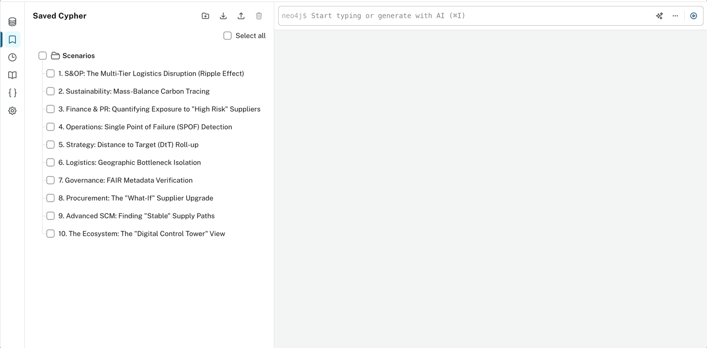
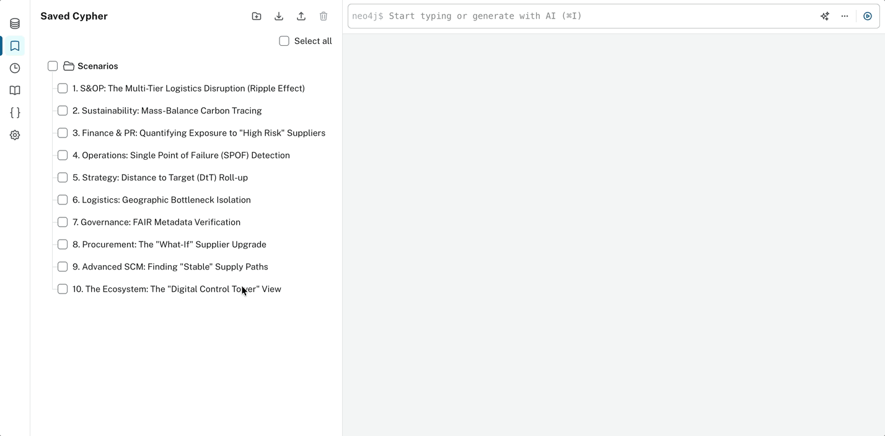
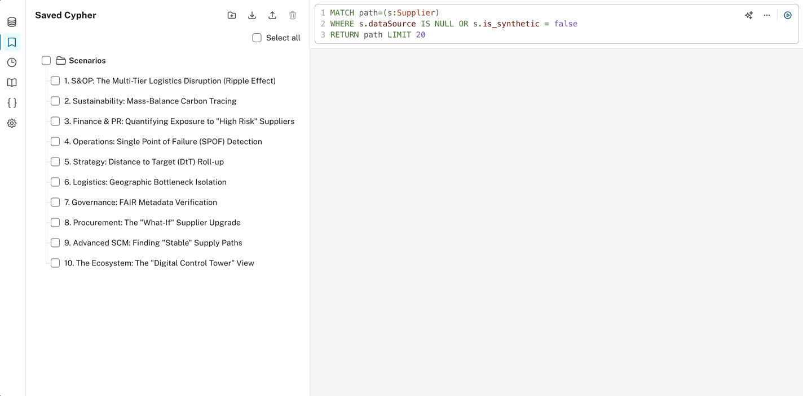
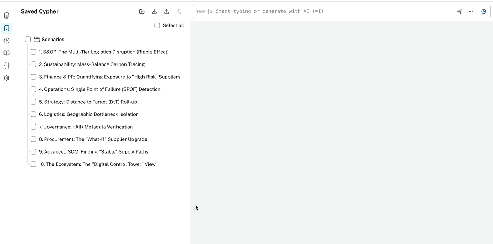

[🏠 Main README](README.md) ❯ 📸 Scenario Gallery

# 📸 LEGO EKP: The Cypher Scenario Gallery

> [!NOTE]
> **TL;DR**: 10 Cypher queries demonstrating enterprise-scale S&OP, ESG, and Finance decision support.

<details>
<summary><b>🗺️ Expand Table of Contents</b></summary>

  - [🧭 Pick Your Graph Adventure](#pick-your-graph-adventure)
- [🏆 The "Hero" Scenarios (Top 3)](#the-hero-scenarios-top-3)
  - [1. S&OP: The Multi-Tier Logistics Disruption (Ripple Effect)](#1-sop-the-multi-tier-logistics-disruption-ripple-effect)
  - [2. Sustainability: Mass-Balance Carbon Tracing](#2-sustainability-mass-balance-carbon-tracing)
  - [3. Finance & PR: Quantifying Exposure to "High Risk" Suppliers](#3-finance-pr-quantifying-exposure-to-high-risk-suppliers)
- [🖼️ The Extended Capability Gallery](#the-extended-capability-gallery)
  - [4. Operations: Single Point of Failure (SPOF) Detection](#4-operations-single-point-of-failure-spof-detection)
  - [5. Strategy: Distance to Target (DtT) Roll-up](#5-strategy-distance-to-target-dtt-roll-up)
  - [6. Logistics: Geographic Bottleneck Isolation](#6-logistics-geographic-bottleneck-isolation)
  - [7. Governance: FAIR(EST) Metadata Verification](#7-governance-fairest-metadata-verification)
  - [8. Procurement: The "What-If" Supplier Upgrade](#8-procurement-the-what-if-supplier-upgrade)
  - [9. Advanced SCM: Finding "Stable" Supply Paths](#9-advanced-scm-finding-stable-supply-paths)
  - [10. The Ecosystem: The "Digital Control Tower" View](#10-the-ecosystem-the-digital-control-tower-view)

</details>
This gallery showcases 10 queries that demonstrate the **Enterprise Knowledge Platform (EKP)** functioning at an enterprise level. These queries move beyond simple graph traversals, embodying Advanced Supply Chain Mathematics (PSI, MRP logic) and Corporate ESG reporting scenarios.

> **To the Reviewer**: If you are exploring the live graph, you can run these exact queries in the Neo4j Browser to replicate the logic natively.

### 🧭 Pick Your Graph Adventure
* 👔 [**The Executive "Hero" Scenarios**](#the-hero-scenarios-top-3) *(Disruptions, ESG Finance & PR)*
* 🧩 [**The Tactical Supply Chain Scenarios**](#the-extended-capability-gallery) *(SPOF, Distance to Target, FAIR(EST) Audits)*

---

## 🏆 The "Hero" Scenarios (Top 3)
*Featured on the main README for their cross-functional executive impact.*

### 1. S&OP: The Multi-Tier Logistics Disruption (Ripple Effect)
* **Stakeholders Benefiting**: S&OP Directors, VP of Supply Chain, Logistics Planners.

> [!NOTE]
> **Business Value**: When a macro disruption (e.g., storm in Taiwan) hits an upstream material provider, planners cannot manually trace the impact across 27,000 SKUs. This query mathematically amplifies upstream delays (Bullwhip Effect) across multiple tiers and predicts *exactly* which downstream regions will face stock-outs, enabling proactive inventory reallocation months in advance.

```cypher
MATCH path=(s2:Supplier {location: "Taiwan", tier: 2})-[r1:SOURCES_TO]->(s1:Supplier)-[r2:SOURCES_TO]->(f:Factory)-[r3:TRANSFORMS_TO]->(st:Set)-[:IN_THEME]->(t:Theme)
// Calculate the amplified temporal delay across tiers
WITH path, t.name as Theme, 
     (r1.current_delay * 1.44) + (r2.current_delay * 1.2) + f.total_lead_time_days AS Amplified_Delay
RETURN path
ORDER BY Amplified_Delay DESC LIMIT 15
```


### 2. Sustainability: Mass-Balance Carbon Tracing
* **Stakeholders Benefiting**: Chief Sustainability Officer (CSO), ESG Compliance Analysts, PR & Marketing.

> [!TIP]
> **Business Value**: Protects the corporate brand against "greenwashing" allegations. By tracing granular Carbon Credits directly to specific raw materials (Bio-PE) using **[Mass Balance Accounting](docs/GLOSSARY.md#mass-balance)**, the CSO gains an irrefutable, data-backed audit trail linking upstream offsets to visible product themes.

```cypher
MATCH path=(cc:CarbonCredit)<-[:OFFSETS_WITH]-(t:Theme)-[:DEPENDS_ON_MATERIAL]->(m:Material {name: "Bio-PE"})
WITH path, t MATCH p2=(t)<-[:IN_THEME]-(st:Set)
WHERE t.distance_to_2032_target < 50
RETURN path, p2 LIMIT 25
```


### 3. Finance & PR: Quantifying Exposure to "High Risk" Suppliers
* **Stakeholders Benefiting**: Risk Committee, CFO, VP of Procurement.

> [!NOTE]
> **Business Value**: Moving beyond qualitative risk maps, this integrates Regional Demand volume with upstream supply constraints. It quantifies the exact financial forecasting tied to suppliers with poor ESG compliance, forcing data-driven decisions to sever or upgrade high-risk dependencies.

```cypher
MATCH path=(reg:Region)-[fc:FORECASTS_DEMAND]->(st:Set)-[:IN_THEME]->(t:Theme)
MATCH (st)<-[:TRANSFORMS_TO]-(fact:Factory)<-[:SOURCES_TO*1..2]-(s:Supplier)
WHERE s.esg_score CONTAINS 'High' AND fc.volume > 9000
RETURN path LIMIT 20
```


---

## 🖼️ The Extended Capability Gallery

### 4. Operations: Single Point of Failure (SPOF) Detection
* **Stakeholders Benefiting**: Operations Managers, Procurement Leads.

> [!TIP]
> **Business Value**: Automatically isolates factories that are entirely dependent on a **[SPOF (Single Point of Failure)](docs/GLOSSARY.md#spof)**. This highlights critical fragility within the structural supply network that manual audits miss.

```cypher
MATCH (f:Factory)<-[r:SOURCES_TO]-(s:Supplier)
WITH f, count(DISTINCT s) as supplier_count, collect(s) as suppliers
WHERE supplier_count = 1
MATCH path=(f)<-[:SOURCES_TO]-(s) WHERE s IN suppliers
RETURN path
```


### 5. Strategy: Distance to Target (DtT) Roll-up
* **Stakeholders Benefiting**: Executive Leadership, Portfolio Directors.

> [!NOTE]
> **Business Value**: A localized maturity scorecard indicating which exact LEGO Themes are severely lagging behind the corporate "100% Sustainable Materials by 2032" goal, driving immediate R&D budget reprioritization.

```cypher
MATCH (t:Theme)<-[:IN_THEME]-(st:Set)<-[:TRANSFORMS_TO]-(f:Factory)<-[:SOURCES_TO*1..2]-(s:Supplier)
WHERE t.distance_to_2032_target > 75  // High distance = Bad maturity
RETURN t, st, f, s LIMIT 30
```


### 6. Logistics: Geographic Bottleneck Isolation
* **Stakeholders Benefiting**: Global Fulfillment Directors, Transportation Managers.
* **Business Value**: Geographically maps the manufacturing-to-fulfillment routing grid. It proves instantly if major demand hubs (e.g., EMEA) are structurally over-reliant on a single bottlenecked manufacturing node (e.g., Monterrey).

```cypher
MATCH path=(s:Supplier)-[:SOURCES_TO*1..2]->(f:Factory {name: "Monterrey Factory"})-[:FULFILLS_TO]->(r:Region {name: "Americas"})
RETURN path
```


### 7. Governance: FAIR(EST) Metadata Verification
* **Stakeholders Benefiting**: Enterprise Architects, Data Stewards, Chief Data Officer.

> [!NOTE]
> **Business Value**: An automated health check for Graph Integrity. Ensures that all critical nodes meet strict enterprise metadata definitions (**[FAIR(EST) Principles](docs/GLOSSARY.md#fairest)**), preventing synthetic or un-tracked data from polluting financial forecasts.

```cypher
MATCH path=(s:Supplier)
WHERE s.dataSource IS NULL OR s.is_synthetic = false
RETURN path LIMIT 20
```


### 8. Procurement: The "What-If" Supplier Upgrade
* **Stakeholders Benefiting**: Category Managers, Procurement Analysts.
* **Business Value**: A simulation sandbox that proves ROI dynamically. If procurement invests capital to upgrade a Tier-2 supplier from Bronze to Platinum, this query traces exactly how many downstream SKUs legally become "ESG Safe."

```cypher
MATCH (s:Supplier {name: "SABIC"})
// Simulating an upgrade to see downstream impact
MATCH path=(s)-[:SOURCES_TO*1..2]->(f:Factory)-[:TRANSFORMS_TO]->(st:Set)
RETURN path
```


### 9. Advanced SCM: Finding "Stable" Supply Paths
* **Stakeholders Benefiting**: Materials Planners, Inventory Managers.
* **Business Value**: In times of crisis, this acts as the "Safe Route Tracing" engine. It models alternative supplier routes lacking active bottlenecks, allowing planners to dynamically reroute purchase orders to guarantee on-time retail delivery.

```cypher
MATCH path=(s:Supplier {tier: 2})-[r:SOURCES_TO]->(s1:Supplier)-[:SOURCES_TO]->(f:Factory)
WHERE r.current_delay = 0
RETURN path LIMIT 25
```


### 10. The Ecosystem: The "Digital Control Tower" View
* **Stakeholders Benefiting**: CxO Corporate Board, Chief Supply Chain Officer.
* **Business Value**: The ultimate 360-Degree Enterprise God-View. This bridges historically siloed ERP domains—Demand (Regions), Manufacturing (Factories), Raw Materials (Suppliers), and Risk (ESG)—in a single mathematically interconnected web.

```cypher
// Caution: Profile this before expanding LIMIT on real environments!
MATCH path=(r:Region)-[:FORECASTS_DEMAND]->(st:Set)<-[:TRANSFORMS_TO]-(f:Factory)<-[:SOURCES_TO*1..2]-(s:Supplier)
RETURN path LIMIT 10
```


---
*Architected and simulated dynamically to prove [EKP](docs/GLOSSARY.md#ekp) feasibility.*

<div align="center">
  <b><a href="README.md">🔙 Return to Main README</a></b> | <b><a href="docs/GLOSSARY.md">📖 Open the Glossary</a></b>
</div>
